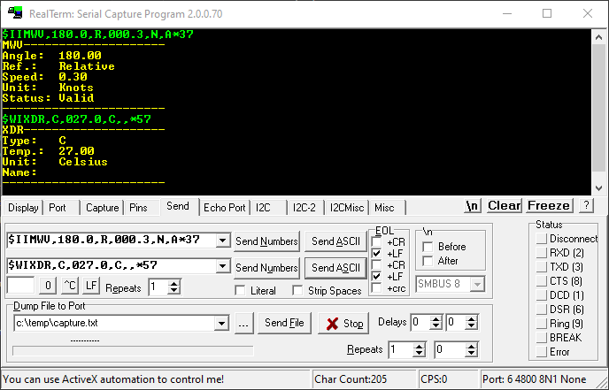

# Matlab folder

This folder contains the Matlab code used for:

- Testing: test the library running on the STM32 board
- Telemetry: plot the data (almost in real time) received from the STM32 board

This part of the repo is still under development.

## Realterm software

To interact with the STM32 board, the [Realterm](https://realterm.sourceforge.io/) software is strongly suggested.

The choice of using an external software instead of the `Matlab` serial communication functions is due to the limitness of the single-thread imposed by `Matlab`.

This means that it was almost impossible to send and at the same time receive data without lagging the whole system.

Also, by using the `Realterm` software we are able to keep the COM port open and run multiple scripts without the need of re-opening the COM port every time.

And finally, it's very handly when we have to send/receive data from the board having a clear and effective feedbak via GUI.

> [!NOTE]
> This workflow may change in the future if we find anything better than this.

## Handling non-USB capable boards

In case we are working with a non-USB board (i.e. `BlackPill`), we could think of connecting out STM32 board to an `Arduino` or similar and then connect the `Arduino` to the PC.

`Arduino` would just serve as a `ECHO` device, forwarding every message received from the STM32 board to the PC and vice-versa.

This would allow us to use the `Matlab` serial communication functions, but it would also add a lot of latency to the system.

See [ArduinoEcho](Common/ArduinoEcho/ArduinoEcho.ino) as a starting point for this purpose.

## Useful links

Here follows a list of useful links:

- [Realterm](https://sourceforge.net/projects/realterm/files/): Serial/TCP Terminal software. Usefull also for "manual" testing like sending single keyboard character and receive data from the STM32 board
- [Arduino](https://www.arduino.cc/): needed in case the approach described [here](#handling-non-usb-capable-boards) is choosen