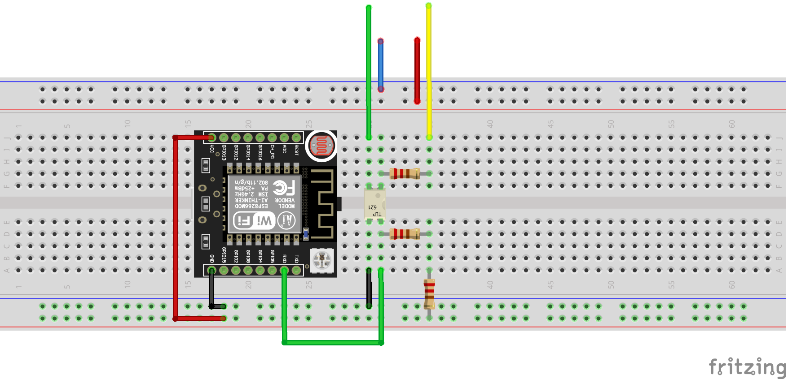

# Windex

This repo contains all the code related to the use of the Windex sensor with the NMEA0183 protocol.

Each main folder contains a `README.md` file that explains briefly the content of the folder.

Just to give a quick overview:

- [src](src): contains the source code of the NMEA0183 library. Here is where you have to write the `C` code that will be directly [uploaded to the ESP32](#how-to-use-with-esp32).
- [ESP32_Windex](ESP32_Windex): contains the code that is uploaded to the ESP32 boards that handle comunication from the Windex sensor to the physical CAN bus.
- [Matlab](Matlab): contains the `MATLAB` code that is used to test/do telemetry of the NMEA0183 library running on the ESP32.

## How to use with ESP32

Refer to this [README](ESP32_Windex/README.md).

## Windex connection

| CV7-E  | Function  |
| ------ | --------- |
| Blue   | (GND)     |
| Red    | (VCC) 12V |
| Yellow | + NMEA    |
| Green  | - NMEA    |

Resistance values must be checked at PST lab.

## References

Here follows a list of repositories that can be used as a reference for the development of the library:

- [SammyB428/NMEA0183](https://github.com/SammyB428/NMEA0183): focused on modularity and simplicity of use, `C++`
- [ttlappalainen/NMEA0183](https://github.com/ttlappalainen/NMEA0183): complete and well written library, `C++`
- [jrcutler/NMEA0183](https://github.com/jrcutler/NMEA0183): quick and dirty approach, `C++`
