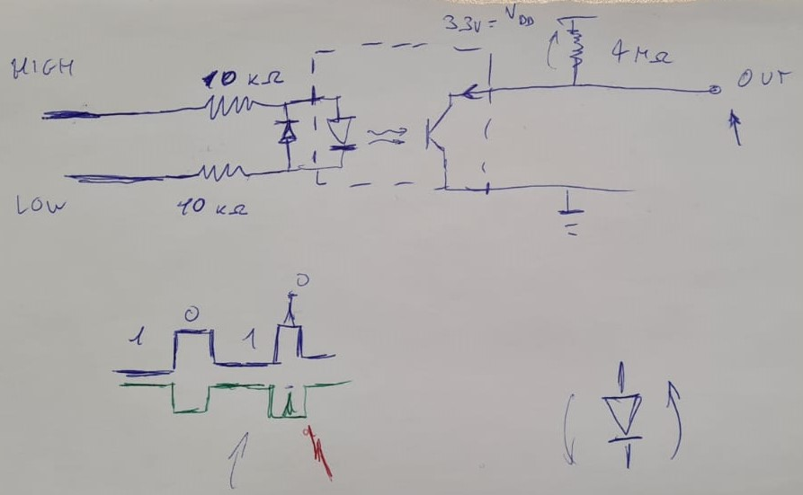

# NMEA0183 (for Windex)

This repo contains all the code related to a NMEA0183 ecosystem.

Each main folder contains a `README.md` file that explains briefly the content of the folder.

Just to give a quick overview:

- [src](src): contains the source code of the NMEA0183 library. Here is where you have to write the `C` code that will be directly [uploaded to the STM32](#how-to-use-with-stm32).
- [Matlab](Matlab): contains the `MATLAB` code that is used to test/do telemetry of the NMEA0183 library running on the STM32.

## How to use with STM32

To use the library with STM32, follow these steps (*@TB* suggest that you create your STM32CubeMX project in the root directory of this repo and name it `STM_Windex`)

1. Open your `.ioc` file and from the connectivity tab click on `USART2` and configure it as follows:

<div align="center">

| Menu               | Name                    | Value        |
| ------------------ | ----------------------- | ------------ |
| /                  | Mode                    | Asynchronous |
| Parameter Settings | Baud Rate               | 4800 Bits/s  |
| Parameter Settings | Word Length             | 8 Bits       |
| Parameter Settings | Parity                  | None         |
| Parameter Settings | Stop Bits               | 1 Bit        |
| NVIC Settings      | USART2 global interrupt | Enabled      |

</div>

2. Generate the code

3. Add the `STM32` preprocessor symbol to your STM32CubeMX project ([guide](https://community.st.com/t5/stm32cubeide-mcus/how-to-add-preprocessor-symbol-in-stm32cube-ide/td-p/273765)):

   1. Right click on the project name and select `Properties`
   2. Go to `C/C++ Build` -> `Settings` -> `Tool Settings` -> `MCU GCC Compiler` -> `Preprocessor`
   3. Click on `Add` and insert `STM32`

4. Copy and paste the library files from the `src` folder of this repo, inside the `Core` folder of your STM32 project keeping the following structure:

```bash
Core
├── Inc
│   ├── sensors
│   │   ├── SENSOR_*.h
│   │   └── ...
│   ├── NMEA0183.h
│   └── sensors.h
└── Src
    ├── sensors
    │   ├── SENSOR_*.c
    │   └── ...
    ├── NMEA0183.c
    └── sensors.c
```

5. Open the `main.c` file and add the following code:

```c
/* USER CODE BEGIN Includes */
#include <string.h>

#include "NMEA0183.h"
#include "sensors/mwv.h"
#include "sensors/xdr.h"
/* USER CODE END Includes */

/* USER CODE BEGIN PV */
uint8_t UART2_rxBuffer[2] = {0};
NMEA0183_t *nmea0183;
/* USER CODE END PV */

/* USER CODE BEGIN PFP */
// https://forum.digikey.com/t/easily-use-printf-on-stm32/20157/2
#ifdef __GNUC__
#define PUTCHAR_PROTOTYPE int __io_putchar(int ch)
#else
#define PUTCHAR_PROTOTYPE int fputc(int ch, FILE *f)
#endif

PUTCHAR_PROTOTYPE
{
   HAL_UART_Transmit(&huart2, (uint8_t *)&ch, 1, HAL_MAX_DELAY);
   return ch;
}
/* USER CODE END PFP */

/* USER CODE BEGIN 2 */
nmea0183 = NMEA0183_Init();
NMEA0183_RegisterSensor(nmea0183, MWV_Init());
NMEA0183_RegisterSensor(nmea0183, XDR_Init());

HAL_UART_Receive_IT(&huart2, UART2_rxBuffer, 1);
/* USER CODE END 2 */


/* USER CODE BEGIN 4 */
void HAL_UART_RxCpltCallback(UART_HandleTypeDef *huart)
{
   NMEA0183_CharacterHandler(nmea0183, UART2_rxBuffer[0]);

   if (NMEA0183_IsDataReady(nmea0183))
   {
      NMEA0183_PrintData(nmea0183);
      NMEA0183_Reset(nmea0183);
   }

   HAL_UART_Receive_IT(&huart2, UART2_rxBuffer, 1);
}
/* USER CODE END 4 */

```

## Windex connection

To be clarified at the PST lab.

<div align="center">



</div>

<!--
| CV7-E  | Function         | STM32 |
| ------ | ---------------- | ----- |
| Blue   | Ground 0V        |       |
| Red    | Power Supply 12V |       |
| Yellow | +NMEA            |       |
| Green  | -NMEA            |       |


-->


## References

Here follows a list of repositories that can be used as a reference for the development of the library:

- [SammyB428/NMEA0183](https://github.com/SammyB428/NMEA0183): focused on modularity and simplicity of use, `C++`
- [ttlappalainen/NMEA0183](https://github.com/ttlappalainen/NMEA0183): complete and well written library, `C++`
- [jrcutler/NMEA0183](https://github.com/jrcutler/NMEA0183): quick and dirty approach, `C++`
